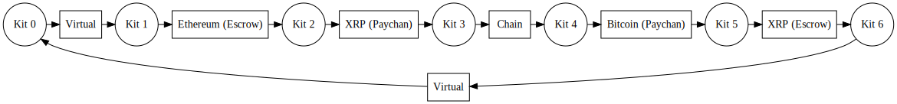
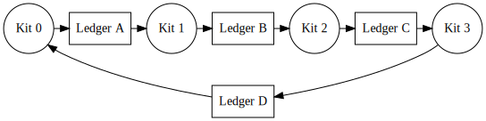
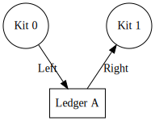

# ILP Demo Maker
> Set up a payment between many different ILP Kit nodes



The ILP Demo Maker constructs a network of ILP Kit nodes for
the purpose of running a demo. Each of the ILP Kits exposes a user interface,
and routing is preconfigured by the script.

## Purpose

Because it can be cumbersome to set up many ILP Kits by hand, the tool uses a
JSON file to generate a docker compose file, containing all the ILP kits used
to set up the required plugins. Below is an example network that this script
could create.



The network created is a ring, allowing any ILP Kit to pay to any other ILP
kit. The payments go in one direction around the ring. The final ledger goes
from the last ILP Kit back to the first one. Below is an example of the JSON
file that could generate this network.

```js
[ {
    "prefix": "example.ledgerA.",
    "currency": "USD",
    "plugin": "ilp-plugin-A",
    "left_account": "example.ledgerA.alice",
    "left_config": {
      /* ... */
    },
    "right_account": "example.ledgerA.bob",
    "right_config": {
      /* ... */
    }
  }, {
    "prefix": "example.ledgerB."
    "currency": "EUR",
    "plugin": "ilp-plugin-B",
    "store": true,
    "left_account": "example.ledgerB.connie",
    "left_config": {
      /* ... */
    },
    "right_account": "example.ledgerB.dave",
    "right_config": {
      /* ... */
    }
  }, {
    "prefix": "example.ledgerC."
    "currency": "BTC",
    "plugin": "ilp-plugin-C",
    "store": true,
    "rpcUri": true,
    "left_account": "example.ledgerC.8OnOc_10khTfRrl00HjBAVjgxnWlJI6lGKaNIxuMJdY",
    "left_config": {
      /* ... */
    },
    "right_account": "example.ledgerC.5mIwWkg-WKw-IvWu13Uz4GCxdrCxWaVzNkpfOehIguI",
    "right_config": {
      /* ... */
    }
  }, {
    "prefix": "example.ledgerD."
    "currency": "XRP",
    "plugin": "ilp-plugin-D",
    "rpcUris": true,
    "left_account": "example.ledgerD.r3528935rjwitjQWFJUIAW",
    "left_config": {
      /* ... */
    },
    "right_account": "example.ledgerD.r35624QWAMdanwdnawhna",
    "right_config": {
      /* ... */
    }
  }
]
```

## Launching the Demo

```sh
$ node generate-docker-compose.js --ledger example.json > docker-compose.yml
$ docker-compose build
$ docker-compose up -d
$ docker-compose logs -f
```

This will create a local directory called `data`, containing all the state
of the ILP Kits. If you add, remove, or rearrange any of the ledgers, make
sure that you delete the `data` folder.

To send some test payments, log into one of your ILP kits with `admin:password`.
You'll need to have the source and destination ILP Kit in your hosts file to do
this. Add an entry for each of your ILP kits in your /etc/hosts file, like so:

```
127.0.0.1 ilp-kit0
127.0.0.1 ilp-kit1
127.0.0.1 ilp-kit2
127.0.0.1 ilp-kit3
```

To send from Kit 0 to Kit 3, log into `ilp-kit0:2010` as `admin`. Send a payment
to `admin@ilp-kit3:5010` in the sending UI.

### Custom Header File

If you need any additional containers in the docker-compose (eg. a bitcoin
node, an extra five-bells-ledger, etc.), you can set an alternate header file.
This will replace the start of the docker-compose (before the ILP Kit
containers are added) with a file of your choice.

```sh
$ node generate-docker-compose.js --ledger example.json --header header.yml > docker-compose.yml
$ docker-compose build
$ docker-compose up -d
$ docker-compose logs -f
```

## Configuration Format Specification

The JSON file used for the ILP Demo maker contains an array of objects in the
below format.

```js
{
  "prefix": "example.ledgerA.", // (1)
  "currency": "USD", // (2)
  "plugin": "ilp-plugin-A", // (3)
  "store": true, // [optional] (4)
  "rpcUri": true, // [optional] (5)
  "rpcUris": true, // [optional] (6)
  "left_account": "example.ledgerA.alice", // (7)
  "left_config": { // (8)
    /* ... */
  },
  "right_account": "example.ledgerA.bob",
  "right_config": {
    /* ... */
  }
}
```

1. `prefix`: The prefix field contains the ILP prefix for this ledger. This prefix must match the value returned by `plugin.getInfo().prefix` for this plugin. If it does not, routing errors will occur, causing all payments to fail.

2. `currency`: The currency code of this ledger. Used by the connector to determine exchange rates.

3. `plugin`: The plugin module for this ledger. Must be cloned as a folder in the current directory.

4. `store`: Set to `true` or `false` (can also be omitted). If this value is `true`, a store will be passed into the plugin constructor, as per the [Ledger Plugin Interface](https://github.com/interledger/rfcs/blob/master/0004-ledger-plugin-interface/0004-ledger-plugin-interface.md#_store).

5. `rpcUri`: Set to `true` or `false` (can also be ommitted). If this value is `true`, an RPC Uri will be passed into the plugin constructor. This URI will point to the peer's RPC endpoint. This will be the correct value for any bilateral plugin (like `ilp-plugin-virtual` or `ilp-plugin-xrp-paychan`).

6. `rpcUris`: Set to `true` or `false` (can also be omitted). If this value is `true`, an object called `rpcUris` will be passed into the plugin constructor. It will have one key, set to the peer's account, and the value will be that peer's RPC Uri. Used for plugins like `ilp-plugin-xrp-escrow` that fall back on RPC for messaging. 



7. `left_account`: The ILP address of the plugin on the left of the ledger. This must match `plugin.getAccount()` for the plugin, or payments will fail. In the above example, the left account is Kit 0's. Due to the routing configuration, payments always go from
the left account to the right account. `right_account` functions the same, but for the plugin on the right.

8. `left_config`: The plugin configuration for the plugin on the left of the ledger. This object is passed directly to the plugin constructor. If `store`, `rpcUri`, or `rpcUris` are set, their fields will be added to this object. `right_config` functions the same, but for the plugin on the right.
